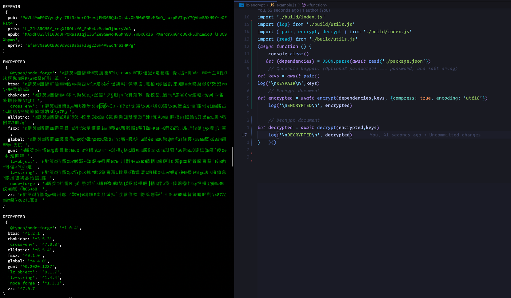

# ChainLocker API

## Secure [Gun](http://www.gun.eco) Extension for NodeJS

Chainlocker Api takes some of your system's immutable data and an optional salts to always produce the same SEA Keypair and GunUserIUnstance method. (UUID was temporarily removed from the immutable data due to permission issues but will be worked back in.)

## Example


### Install

``` yarn add chainlocker ```

#### What I have so far

  - [x] Proof of Work like hashing produces a keypair against password/ salt array and immutable machine/user info.
  - [x] Encryption/ LZ-String compression traverses object values instead of stringifying objects to encrypt. Object values are not encrypted or compressed.
  - [x] encryption key stays in context so no need to store on disk or write it down.

